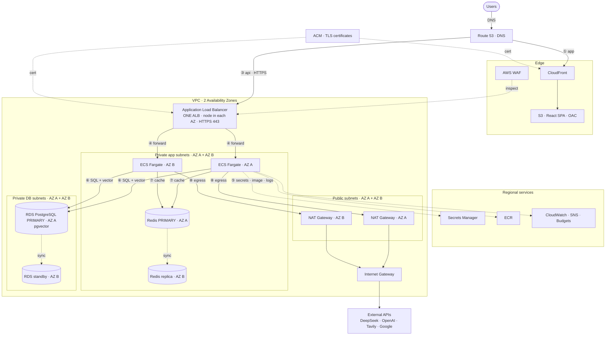

# Aether

An AI Marketing assistant web app: FastAPI + async SQLAlchemy backend, React +
TypeScript frontend, with a DeepSeek-powered tool-calling agent for managing
your tasks, notes, calendar, and more.

A full-stack project: streaming chat, a tool-calling agent, JWT auth, OAuth
integrations, background-free async I/O end to end, and a test suite + CI on
both the backend and frontend.

## Cloud architecture (AWS)

> **Production-grade AWS architecture, defined as Terraform** — VPC, ECS Fargate,
> RDS + pgvector, CloudFront/S3, WAF, Secrets Manager, and a gated CI/CD pipeline.
> Validated in CI and **one-command deployable**; run **ephemerally**
> (`make up` / `make down`) so idle cost is ~$0. Full IaC in
> [`infra/terraform/`](infra/terraform/) · deploy runbook in
> [`infra/terraform/README.md`](infra/terraform/README.md) · design decisions in
> [`docs/architecture/`](docs/architecture/).



> **Reading the diagram:** there is **one** ALB with a node in each AZ; it forwards
> to Fargate in **both** AZs. **Both** Fargate tasks connect to the **primary** RDS
> and **primary** Redis (in AZ A) — the standby/replica receive only replication
> (`sync`) and are never queried directly; on failover AWS promotes them and the
> endpoint DNS flips automatically.

**Request flow:** ① a user loads the SPA over **HTTPS via CloudFront** (private
S3, OAC); ② the browser calls the API over **HTTPS at the ALB** (ACM cert),
fronted by **AWS WAF**; ③ the ALB forwards to **FastAPI on ECS Fargate** in
private subnets; ④ Fargate reads secrets from **Secrets Manager** at startup
(`valueFrom`) and pulls its image from **ECR**; ⑤ it queries **RDS PostgreSQL**
(relational data **and** pgvector semantic search) and, in HA, **ElastiCache
Redis**; ⑥ outbound LLM/tool calls egress via **NAT**; ⑦ logs and alarms flow to
**CloudWatch → SNS**, with spend guarded by **AWS Budgets**.

| App component | AWS service |
|---|---|
| React SPA (static build) | **S3 + CloudFront** (OAC, HTTPS, security headers) |
| FastAPI (container) | **ECS Fargate** (Graviton) behind an **ALB**, in a **VPC** |
| PostgreSQL + pgvector | **Amazon RDS (PostgreSQL 16 + pgvector)** |
| Cache / shared rate-limit (HA) | **Amazon ElastiCache for Redis** (Multi-AZ) |
| Secrets | **Secrets Manager** (injected via `valueFrom`, never in the image) |
| Container image | **ECR** (scan-on-push) |
| Edge protection | **AWS WAF** (rate-limit + AWS managed rule groups; `SizeRestrictions_BODY` set to *count* so CSV/TSV uploads aren't blocked) |
| Egress to external LLM/APIs | **NAT Gateway** |
| Observability / cost | **CloudWatch, SNS, AWS Budgets** |

> The diagram shows the **HA topology**. A single boolean — `high_availability`
> — flips the stack between a cost-optimized demo (**1 NAT**, single-AZ RDS, 1
> task, no Redis) and production (**per-AZ NAT**, Multi-AZ RDS, autoscaling, and a
> **Multi-AZ ElastiCache Redis replication group** with automatic failover).

### Production-readiness

- **Networking** — 3-tier subnets (public / app / db) across 2 AZs; compute and
  DB in private subnets; VPC default security group locked to deny-all;
  reference-based SG chain (ALB → API → RDS/Redis, no CIDR leakage);
  **PrivateLink** — an S3 gateway endpoint plus interface endpoints (ECR api/dkr,
  Secrets Manager, CloudWatch Logs) so image pulls, secret fetches, and log
  shipping stay on the AWS backbone instead of egressing through NAT.
- **Compute** — ECS Fargate on Graviton; deployment **circuit breaker with
  auto-rollback**; target-tracking autoscaling in HA.
- **Data** — Amazon RDS PostgreSQL + pgvector, **encrypted at rest**; Multi-AZ +
  automated backups in HA; **Amazon ElastiCache for Redis** as a Multi-AZ
  replication group (auto-failover, encryption in transit + at rest) for shared
  state at scale.
- **Edge & TLS** — CloudFront (OAC, HSTS + security headers); **ACM cert +
  HTTPS ALB listener** with a TLS 1.2+ policy; HTTP → HTTPS redirect; AWS WAF.
- **Secrets & IAM** — Secrets Manager via `valueFrom`; **two least-privilege IAM
  roles** (execution role scoped to specific secret ARNs; an intentionally empty
  task role — the app calls no AWS APIs).
- **IaC** — Terraform with reusable modules, **remote state + locking**, the
  single `high_availability` toggle, and org tagging via `default_tags`.
- **CI/CD** — GitHub Actions with **OIDC (no static keys)** and three gates:
  **Infracost** (cost), **Checkov** (IaC), **Trivy** (container CVEs); rolling
  deploy with auto-rollback.
- **Cost & ops** — CloudWatch alarms → SNS, a **CloudWatch dashboard**
  (ALB · ECS · RDS, plus **LLM token/cost/latency**), an **AWS Budgets** alert, a
  **runaway-LLM-cost alarm**, and an ephemeral `apply → demo → destroy` model
  with a `verify-clean` orphan check.

### Production roadmap (known next steps)

Deliberately **not** implemented yet — the stack runs as a cost-optimized,
ephemeral demo, so several standing-production controls are documented as
accepted trade-offs (see [`infra/terraform/.checkov.yaml`](infra/terraform/.checkov.yaml))
rather than built. For a permanent production environment, the next steps are:

- **Observability** — distributed tracing (AWS X-Ray / OpenTelemetry ADOT
  sidecar) to break down request latency across ALB → Fargate → RDS → DeepSeek.
  (Per-turn LLM **token/cost/latency** are already emitted as CloudWatch custom
  metrics via EMF — see the Observability feature below.)
- **Security & audit** — **CloudTrail** (account API audit), **VPC Flow Logs**,
  **GuardDuty** threat detection, access logs (ALB/CloudFront/WAF), a
  **CloudFront-scoped WAF** for the edge, **Secrets Manager rotation**, and
  customer-managed **KMS keys**.
- **Resilience / DR** — cross-region RDS snapshot copy + **Route 53** health-check
  failover; ElastiCache snapshots; NACLs for subnet-level defense-in-depth.

## Features

- **Chat** with a DeepSeek-powered assistant, streamed over SSE with markdown
  rendering and visible "thinking"/tool-call traces.
- **Personas** — switch the assistant's tone per conversation (productivity
  coach, research assistant, casual friend).
- **Tools** the assistant can call on your behalf: create/update/list tasks
  and notes, get the weather (data.gov.my), web search (Tavily), and manage
  your Google Calendar.
- **Memory** — long conversations are automatically summarized so context
  doesn't grow unbounded, folding older turns at a safe boundary that never
  splits a tool call from its result.
- **Tasks** — a kanban-style board (To do / Doing / Done) with priorities and
  due dates.
- **Notes** — notes with tags and **semantic search**: notes are embedded
  (OpenAI `text-embedding-3-small`) and stored in Postgres via **pgvector**, so
  the assistant retrieves by meaning, not just keywords. Falls back to a keyword
  scan when no embedding key is configured.
- **RAG eval harness** — a reproducible eval suite for the note-search retrieval
  + generation pipeline, measuring the three canonical **RAGAS** metrics
  (faithfulness, context precision, answer relevancy) plus retrieval recall over
  a curated golden dataset, with a documented **failure-mode log**. Runs against
  the real retriever; keyless offline mode for CI. See
  [`api/app/eval/`](api/app/eval/README.md) and run it with `make eval`.
- **Analytics dashboard** — messages and token usage per day, tool-usage
  breakdown, and lifetime totals.
- **Auth** — short-lived JWT access tokens kept in memory, plus refresh tokens
  delivered as **HttpOnly cookies** (not readable by JS). Refresh tokens
  **rotate on every use** with **reuse detection**: replaying a rotated token
  revokes the whole token family.
- **Rate limiting** on chat and external-API tools (web search, calendar). The
  in-memory sliding-window limiter periodically evicts idle keys so it stays
  bounded on a long-running instance (Redis-backed for multi-instance HA).
- **Prompt-injection guardrail** — the base system prompt marks tool, web, and
  note content as untrusted data: embedded directives are ignored, and
  unrequested destructive actions require explicit confirmation.
- **Encrypted credentials** — Google OAuth tokens are stored Fernet-encrypted
  at rest, and disconnecting revokes the grant at Google's endpoint (not just a
  local delete).
- **Observability** — the agent loop emits greppable `key=value` logs (per-turn
  token/tool/latency, tool calls, stream failures) and, in deployed
  environments, per-turn **CloudWatch EMF metrics** (tokens, estimated cost,
  latency) that power an **LLM usage/cost dashboard** and a runaway-cost alarm —
  no metrics agent or `PutMetricData` required. `user_id` is deliberately kept
  out of the metric dimensions to bound custom-metric cardinality (cost).

## Stack

- **Backend**: Python 3.12, FastAPI, SQLAlchemy 2.0 (async), Alembic, Postgres
  (SQLite for tests), Pydantic v2, JWT auth.
- **Frontend**: React 19, TypeScript, Vite, Tailwind CSS v4, shadcn/ui-style
  components, TanStack Query, Recharts, Zustand.
- **Infrastructure**: **Terraform** (modular, remote state + locking) on **AWS** —
  VPC, **ECS Fargate** (Graviton) behind an **ALB**, **RDS PostgreSQL + pgvector**,
  **S3 + CloudFront**, **AWS WAF**, **Secrets Manager**, and CloudWatch/SNS/Budgets
  for observability and cost. Split into a persistent base layer and an ephemeral
  stack layer, so a full demo is `make up` / `make down` with idle cost ~$0.
- **CI/CD**: **GitHub Actions** with **OIDC** (no static keys) — app lint + tests
  (SQLite *and* Postgres + pgvector legs), and **Infracost** (cost), **Checkov**
  (IaC), and **Trivy** (container CVE) gates on the infrastructure.

See [Cloud architecture (AWS)](#cloud-architecture-aws) for the full topology,
and [`infra/terraform/`](infra/terraform/) for the modules.

## Application architecture

```
web/ (React + Vite)                       api/ (FastAPI, async)
  ├─ pages/        chat, tasks, notes,       ├─ api/routes/   auth, conversations,
  │                analytics, settings       │                tasks, notes,
  ├─ api/          typed fetch clients        │                analytics, integrations
  └─ store/        Zustand auth + theme       ├─ agent/        loop, tools, personas,
                                              │                memory, client
        │  SSE stream (EventSource)           ├─ services/     embeddings, note search,
        │  Bearer access token                │                refresh tokens, google
        ▼                                      ├─ core/         security, crypto, config,
  POST /conversations/{id}/messages           │                rate_limit, logging
        │                                      └─ models/       SQLAlchemy 2.0 (async)
        ▼                                            │
  agent/loop.py  ──►  DeepSeek (tool-calling, thinking mode)
        │                    │
        │  ◄── tool_calls ───┘
        ▼
  agent/tools.py  ──►  DB (tasks/notes) · data.gov.my · Tavily · Google Calendar
```

The **agent loop** ([`api/app/agent/loop.py`](api/app/agent/loop.py)) is the
core: it builds conversation context (with automatic summarization of older
turns), calls DeepSeek with the tool schemas, and streams the response back to
the browser as Server-Sent Events. Distinct SSE event types — `reasoning`
(visible "thinking"), `token` (assistant text), tool-call traces, and `error` —
let the UI render each phase live. When the model requests a tool, the loop
dispatches to a handler, feeds the result back, and continues until the model
produces a final answer.

## Getting started

### Prerequisites

- Docker and Docker Compose
- (Optional, for running outside Docker) Python 3.12 and Node 20+

### 1. Configure environment variables

From the project root:

```sh
cp .env.example .env
```

Open `.env` and fill in the values you have. The app runs locally without any
external API keys — `DEEPSEEK_API_KEY`, `TAVILY_API_KEY`, and the
`GOOGLE_CLIENT_*` Google Calendar credentials only need to be set to use the
chat assistant, web search tool, and calendar integration respectively.

For `SECRET_KEY` and `ENCRYPTION_KEY`, generate real values rather than using
the placeholders:

```sh
python3 -c "import secrets; print(secrets.token_urlsafe(64))"          # SECRET_KEY
python3 -c "from cryptography.fernet import Fernet; print(Fernet.generate_key().decode())"  # ENCRYPTION_KEY
```

> Note: `docker-compose.yml` reads this `.env` from the project **root** (not
> `api/.env`). The root `.env` file is gitignored.

### 2. Start everything with Docker Compose

```sh
docker compose up --build
```

- API: http://localhost:8000 (interactive docs at `/docs`)
- Frontend: http://localhost:5173

The first time you run this, apply database migrations:

```sh
docker compose exec api alembic upgrade head
```

Register an account at http://localhost:5173/register and start chatting.

## Screenshots

Add screenshots of the chat, tasks board, and analytics dashboard to
`docs/screenshots/` and reference them here, e.g.:

```md


```

## Running tests

Backend:

```sh
cd api
pip install -r requirements-dev.txt
ruff check .
pytest
```

Frontend:

```sh
cd web
npm install
npm run lint
npm run build
npm run test
```

Both suites run automatically on every push/PR via GitHub Actions
(`.github/workflows/ci.yml`).

## Deployment

### AWS (primary — Terraform)

The primary target is **AWS**, fully defined as Terraform under
[`infra/terraform/`](infra/terraform/) — see the [architecture](#cloud-architecture-aws)
above and the [deploy runbook](infra/terraform/README.md). It's a two-layer stack
(persistent edge + ephemeral compute) driven by a `Makefile`:

```sh
make base-up   # persistent layer: ECR, S3+CloudFront, Secrets Manager
make image     # build + push the ARM64 API image to ECR
make up        # ephemeral layer: VPC, ALB, ECS, RDS (+ migrations)
make web       # build the SPA, sync to S3, invalidate CloudFront
# ... demo ...
make down      # destroy the ephemeral layer → hourly billing stops
```

Flip `make up HA=true` for the production-grade shape (Multi-AZ RDS, autoscaling,
Redis).

> **A custom domain is required for a working end-to-end browser demo.** Without
> one, the API is served over plaintext HTTP on the ALB — which the HTTPS SPA
> can't call (mixed content), and `Secure` refresh cookies won't set. `make web`
> prints a warning when it detects an HTTP-only API URL. Set `api_domain_name`
> (below) for HTTPS end-to-end.

**Custom domain (Route 53 + ACM).** Create a Route 53 public hosted zone for your
domain and delegate your registrar's nameservers to it, then:
- **Frontend** (CloudFront) — set `frontend_domain_name` + `hosted_zone_name` in
  `layer1_persistent/terraform.tfvars`. Serves the SPA at the apex + `www` over
  HTTPS (ACM cert auto-created in `us-east-1`).
- **API** (ALB) — set `api_domain_name` + `hosted_zone_name` in
  `layer2_ephemeral/terraform.tfvars`. Serves the API at `api.<domain>` over
  HTTPS (regional ACM cert). Certs are DNS-validated automatically via the zone.

### Alternative (managed PaaS)

For a quick managed deploy without AWS: push `api/` + a managed Postgres to
[Render](https://render.com)/[Railway](https://railway.app) and `web/` to
[Vercel](https://vercel.com). See `render.yaml` and `web/vercel.json`.

### Google Calendar OAuth in production

The Google integration works out of the box for local development, where the
redirect URI points at `localhost`. To make it work on a deployed domain:

1. **Update the environment variables** to your production URLs:
   - `GOOGLE_REDIRECT_URI` → `https://<your-api-domain>/api/v1/integrations/google/callback`
   - `FRONTEND_ORIGIN` → `https://<your-frontend-domain>`
2. **Register the redirect URI in the Google Cloud Console**: under
   *APIs & Services → Credentials → your OAuth 2.0 Client ID*, add the exact
   production `GOOGLE_REDIRECT_URI` above to **Authorized redirect URIs**. It
   must match character-for-character or Google will reject the callback.
3. **Publish the OAuth consent screen** (or add testers): a new OAuth app
   starts in *Testing* mode and only allows accounts listed as test users.
   Either add the accounts you'll sign in with as test users, or submit the
   app for verification to allow any Google account.

The same applies to any other origins (`localhost:5173`) referenced in the
consent screen's *Authorized JavaScript origins*.
