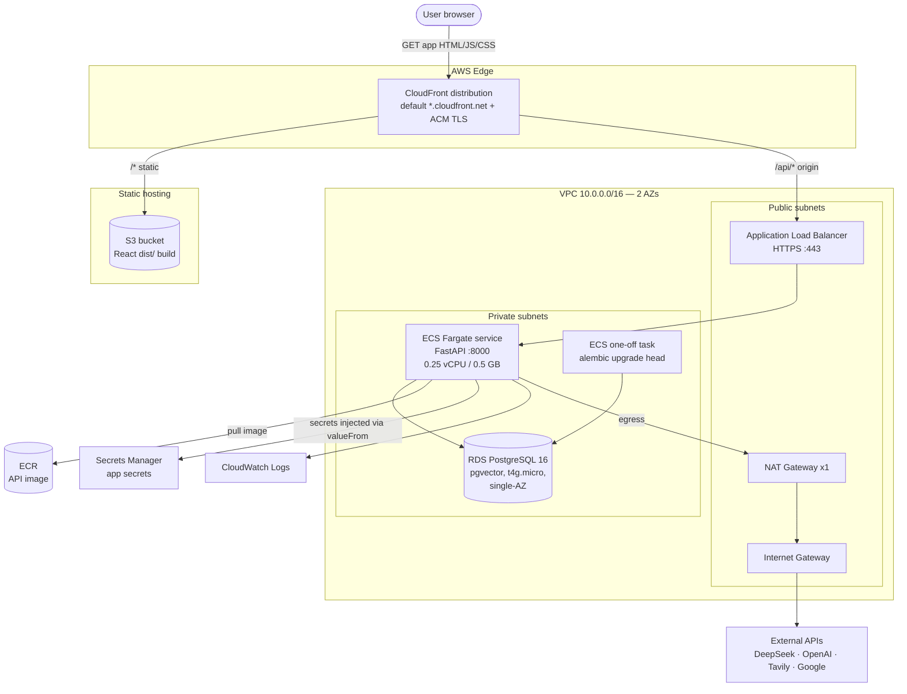
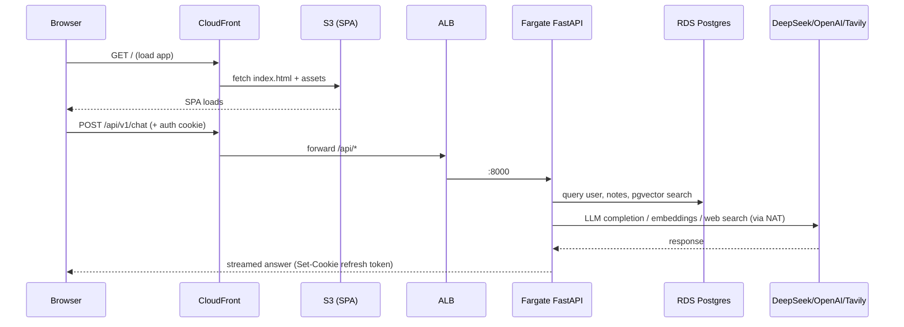

# Aether — AWS Deployment Plan (ECS Fargate, ephemeral demo)

## Context

**Aether** is a personal-AI-assistant app currently containerized for local dev (`docker-compose.yml`) and configured for Render/Vercel. The goal is a **production-grade AWS architecture** that can be stood up for a **~1-hour demo and fully destroyed afterward** so the bill stays under ~$1 instead of ~$80–100/month.

The app naturally partitions into distinct AWS resources:

| App piece | What it is | AWS resource |
|-----------|-----------|--------------|
| Frontend | React 19 + Vite SPA, static `dist/` | **S3 + CloudFront** |
| API | FastAPI (uvicorn, port 8000) | **ECS Fargate** service behind an **ALB** |
| Database | Postgres 16 + **pgvector** | **RDS PostgreSQL** (t4g.micro) |
| Migrations | `alembic upgrade head` | **One-off ECS task** (run once) |
| Secrets | JWT/Fernet keys, LLM/API keys | **Secrets Manager** (injected via ECS `valueFrom`) |
| Images | API container | **ECR** |
| Egress to DeepSeek/OpenAI/Tavily/Google | outbound HTTPS | **NAT Gateway** (single) |
| Logs | container + ALB logs | **CloudWatch Logs** |

**Confirmed decisions:** Terraform (one-command `apply`/`destroy`) · private subnets + **1 NAT Gateway** (true prod pattern) · **no custom domain** — CloudFront default domain + ACM for HTTPS (needed for the `Secure`/`SameSite=none` refresh cookie).

---

## 1. Architecture diagram

**Why CloudFront in front of both S3 and the ALB:** the SPA and API are served under one HTTPS origin (`https://<id>.cloudfront.net`, `/api/*` → ALB, everything else → S3). This gives the API a valid TLS name with no custom domain, and makes the frontend + API **same-origin**, which sidesteps CORS and lets the refresh-token cookie work with `Secure`. (Alternative: separate CloudFront for the SPA + ACM cert directly on the ALB — but same-origin is simpler for the demo.)

---

## 2. Request / workflow flow

**Startup order (Terraform + deploy):**
1. `terraform apply` → VPC, subnets, NAT, RDS, ALB, ECR, ECS cluster, Secrets Manager, CloudFront, S3.
2. Build & push API image to ECR; build SPA (`VITE_API_URL=/api/v1`) and sync `dist/` to S3.
3. Run the **one-off migration ECS task** (`alembic upgrade head`) — creates tables + `CREATE EXTENSION vector`.
4. ECS Fargate service starts, health check `GET /health`, registers in ALB target group.
5. Demo. Then `terraform destroy` → everything gone.

---

## 3. The container(s)

**API container (needs a small change from the current dev Dockerfile):**
- Current `api/Dockerfile` installs `requirements-dev.txt` and runs `--reload`. For the demo, either reuse it as-is (fine, just heavier) or add a lean prod stage: install `requirements.txt` only, run `uvicorn app.main:app --host 0.0.0.0 --port 8000` (no `--reload`).
- Secrets injected by ECS via `valueFrom` (Secrets Manager ARNs): `DATABASE_URL`, `SECRET_KEY`, `ENCRYPTION_KEY`, `DEEPSEEK_API_KEY`, `OPENAI_API_KEY` (optional), `TAVILY_API_KEY`, `GOOGLE_CLIENT_ID/SECRET`. Plain env for non-secrets: `ENVIRONMENT=production`, `TRUST_PROXY_HEADERS=true` (behind ALB), `FRONTEND_ORIGIN`, cookie settings (`REFRESH_COOKIE_SECURE=true`, `REFRESH_COOKIE_SAMESITE=none`).
- Migration task = **same image**, command overridden to `alembic upgrade head`.

**Frontend container: none.** The SPA builds to static `dist/` and is served from S3/CloudFront — no web Dockerfile needed for prod (the existing `web/Dockerfile` is dev-only). Build-time `VITE_API_URL=/api/v1` (same-origin via CloudFront).

**Note — rate limiting:** it's in-process (`api/app/core/rate_limit.py`), no Redis. Keep the Fargate service at **1 task** for the demo so limits behave globally. (Multi-task would make limits per-task; out of scope for a 1hr demo.)

---

## 4. Cost — the whole point

Approximate **us-east-1** on-demand pricing. Everything below is destroyed by `terraform destroy`.

| Resource | Rate | ~1 hour | If left a month |
|----------|------|--------|-----------------|
| NAT Gateway | $0.045/hr + data | ~$0.05 | ~$33 |
| Application Load Balancer | $0.0225/hr + LCU | ~$0.03 | ~$18 |
| RDS db.t4g.micro (single-AZ) | ~$0.016/hr + 20GB gp3 | ~$0.02 | ~$13 |
| Fargate 0.25 vCPU / 0.5 GB (1 task) | ~$0.012/hr | ~$0.01 | ~$9 |
| CloudFront / S3 / ECR / Secrets Manager / Logs | usage-based | <$0.05 | ~$1–3 |
| **Total** | | **≈ $0.15–0.30** | **≈ $75–90** |

**This is exactly why the whole stack is Terraform-managed.** A 1-hour demo costs pocket change; the ~$100 bill only happens if the **NAT Gateway, ALB, or RDS instance are left running**. Cost guardrails baked into the plan:
- **Secrets Manager** with the app keys consolidated into a single JSON secret (+ one ephemeral DB-URL secret) → ~$0.80/month total, and prorated by the hour it's negligible for a 1-hour demo. Chosen over SSM Parameter Store for native ECS `valueFrom` integration and built-in rotation; the per-secret cost is immaterial at this scale.
- **Single NAT Gateway**, not one per AZ.
- **RDS `skip_final_snapshot = true`, `deletion_protection = false`** → `destroy` actually deletes it, no leftover snapshot storage.
- No orphans: release the NAT's Elastic IP, empty the S3 bucket (`force_destroy = true`) so `destroy` completes cleanly.
- **Teardown one-liner:** `terraform destroy -auto-approve` (add a `make destroy` target).

---

## 5. Files to create (when the infra is built)

- `infra/terraform/` — `vpc.tf`, `rds.tf`, `ecs.tf`, `alb.tf`, `cloudfront.tf`, `secrets.tf`, `ecr.tf`, `variables.tf`, `outputs.tf`.
- A lean prod stage in `api/Dockerfile`.
- A `Makefile` with `deploy` / `destroy` targets.

## 6. Verification (when infra is built)

1. `terraform apply` completes; note the CloudFront domain output.
2. `curl https://<cloudfront>/health` → `{"status":"ok"}` (via `GET /health`).
3. Migration task logs in CloudWatch show `alembic upgrade head` + `CREATE EXTENSION vector` success.
4. Open the CloudFront URL → SPA loads → sign up / chat works (exercises DB, pgvector, DeepSeek egress through NAT).
5. `terraform destroy` → confirm in Cost Explorer / console that NAT GW, ALB, and RDS are gone.
